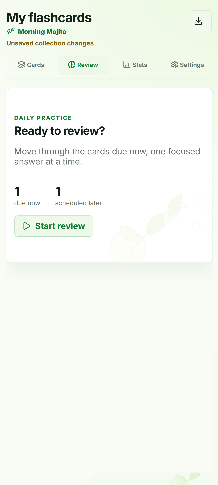
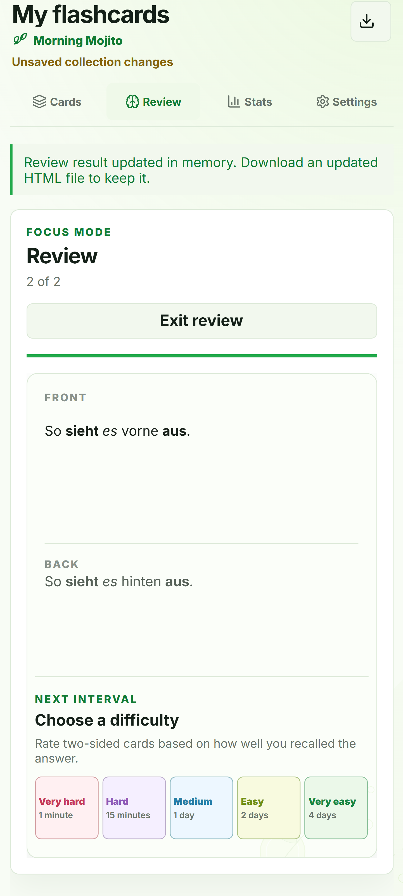
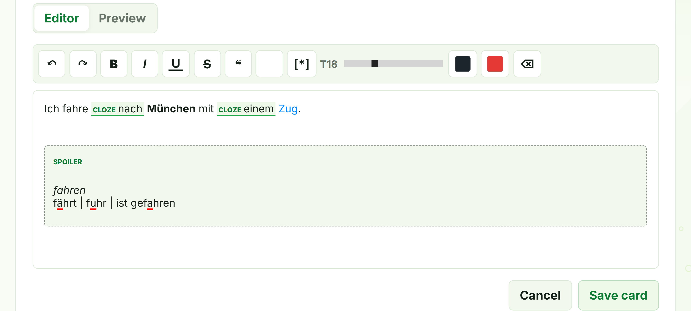
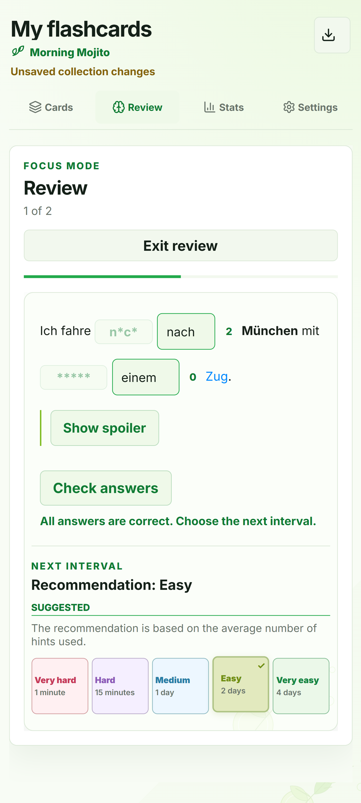
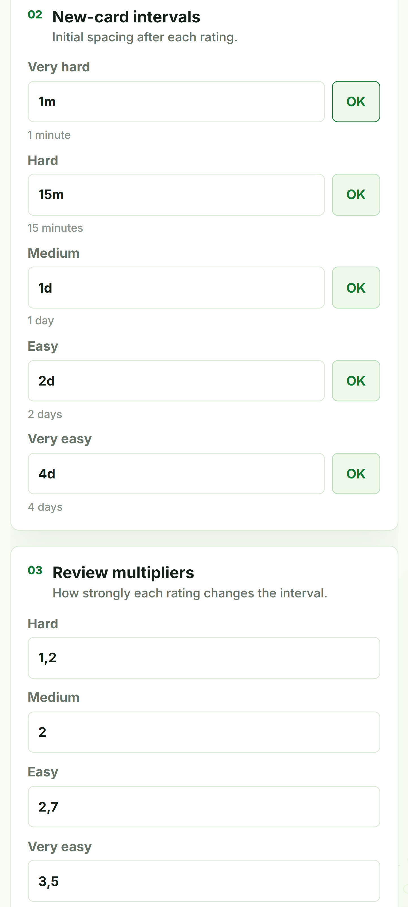
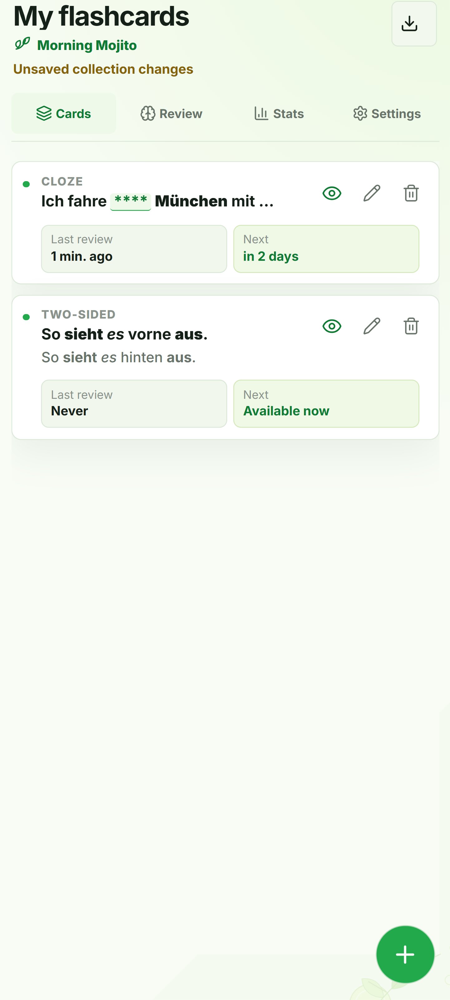
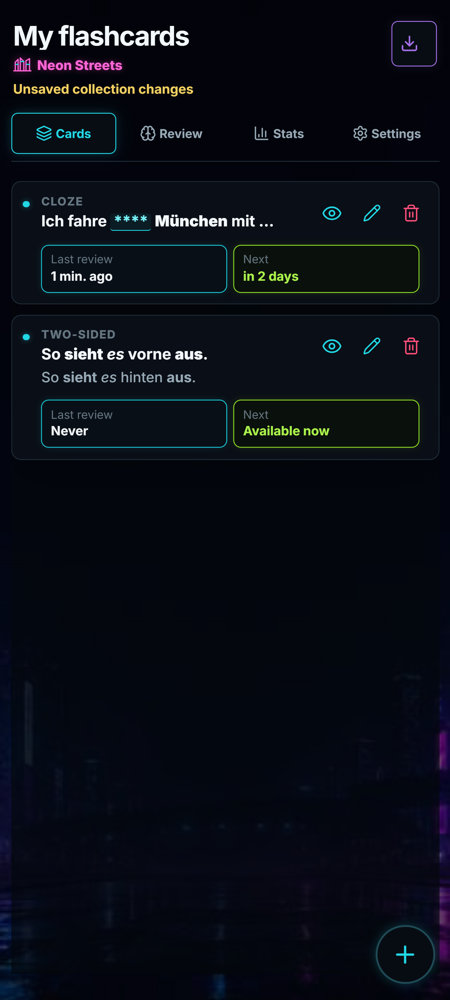

# SP Words Book

A self-contained flashcard application for creating and reviewing learning cards as a single portable HTML file.

I started this project from a simple question:

> **Can a fully interactive web application keep both its runtime and persistent data inside a single file — and still remain practical to use?**

I liked the idea of a flashcard collection behaving more like an ordinary document: something that can be copied, stored, moved to another device, and opened directly in a browser without installing an application or maintaining a server.

That constraint gradually shaped the whole project. SP Words Book now combines two-sided and Cloze cards, rich-text editing, hints, configurable spaced repetition, learning statistics, and two visual themes — while the application and all of its persistent data still remain inside one portable HTML file.

The application works without a backend, external database, account, or permanent internet connection.

<p align="center">
  
</p>

---

## What the application does

SP Words Book is meant for learning material that benefits from both flexible recall and exact recall.

It supports:

- **two-sided cards** for front/back review;
- **Cloze cards** for hiding one or more words inside a sentence or text;
- **hints** that gradually reveal letters;
- **configurable spaced repetition**;
- **learning statistics** stored together with the collection;
- **rich-text editing** with formatting and spoiler blocks;
- **portable persistence** inside one HTML file;
- **direct `file://` usage** without a server after the production build.

---

## Flashcard mechanics

I wanted the application to support two different kinds of recall rather than force every piece of information into the same flashcard format.

### Two-sided cards

A two-sided card contains independent front and back sides.

This format is useful when information does not need to be reproduced word-for-word. A sentence can often be translated correctly in several ways, and a definition can be expressed with different wording while preserving the same meaning.

After revealing the back side, the user evaluates the quality of the recall manually.

<p align="center">
  
</p>

### Cloze cards

Cloze cards became especially important for vocabulary learning. When learning a word inside a sentence, it is useful to preserve the surrounding context while still requiring the exact word or spelling to be recalled.

One or more words can be hidden inside a text. During Review, each hidden word must be entered correctly.

The editor also supports spoiler blocks. They can be used for optional hints, grammar notes, explanations, or visual grouping of content, including content that contains Cloze words.

<p align="center">
  
</p>

### Hints

I did not want hints to reveal the same letters every time, because that can make it too easy to remember the hint pattern instead of the word itself.

If a hidden word cannot be recalled, the user can click the asterisks to reveal letters.

Each hint reveals approximately **one quarter of the letters and numbers in the answer, but never fewer than one character**.

An attempt means one appearance of the card during Review. At the beginning of each attempt, a random reveal order is generated once for every hidden word. That order remains unchanged during the current attempt and is generated again the next time the card appears.

This means repeated reviews do not always expose the same letters in the same sequence. The word must be reconstructed from different partial cues instead of relying on one fixed hint pattern.

### Suggested difficulty

After all hidden words have been entered correctly, the application calculates the average number of hints used and suggests a difficulty rating:

```text
average = 0        → Very easy
0 < average ≤ 1    → Easy
1 < average ≤ 2    → Medium
2 < average ≤ 3    → Hard
average > 3        → Very hard
```

The suggestion is additional feedback only. It does **not** automatically determine the next review interval.

The user can select another rating, and the selected rating is the one used by the scheduling system.

<p align="center">
  
</p>

### Spaced repetition

I wanted the repetition model to stay configurable rather than force one fixed learning strategy.

Cards move through two scheduling stages.

**New cards** use fixed review intervals. A separate interval can be configured for each difficulty level.

Once a card enters the **review stage**, most ratings calculate the next interval from the previous one:

```text
next interval =
previous interval × difficulty multiplier
```

Selecting **Very hard** returns the card to the learning stage and uses its configured fixed interval instead.

The Settings section allows the user to configure independently:

- the fixed interval for each difficulty level of new cards;
- the interval multiplier for each difficulty level of review cards.

<p align="center">
  
</p>

### Learning statistics

I wanted the collection to keep its learning history when it moves between devices, rather than leaving that history behind in browser storage.

The Stats view records new-card views, repeat reviews, and selected ratings as part of the same portable data. Activity can be explored over 7 days, 30 days, 3 months, 6 months, or 1 year, with daily, weekly, or monthly presentation depending on the selected period.

---

## Why a single HTML file?

A typical web application often depends on several layers:

```text
Frontend
   ↓
Backend / API
   ↓
Database
```

SP Words Book deliberately removes the backend and external database.

The final HTML file contains:

- the application interface;
- JavaScript and CSS;
- embedded graphics;
- flashcards;
- settings;
- spaced-repetition state;
- learning statistics.

The file can be moved to another device and opened directly in a modern browser through `file://`, without installing the application or starting a server.

This makes the HTML file both the application and the user's portable collection.

---

## How persistence works

Persistent application data is stored inside the HTML document in a dedicated JSON block:

```html
<script id="app-data" type="application/json">
```

When the file is opened, the application parses this JSON, applies the supported migration when necessary, validates the resulting persistent state, and only then exposes it to the application.

```text
HTML + embedded data
        ↓
open in browser
        ↓
read app-data
        ↓
apply migration if needed
        ↓
validate persistent state
        ↓
in-memory state
        ↓
edit / review
        ↓
Download HTML
        ↓
new HTML + updated data
```

Persistent collection state and transient UI/editor state are kept separate. Changes made during a session exist in browser memory, and the currently opened HTML file is never modified in place.

When the user selects **Download HTML**, the application validates the current state, creates a copy of the HTML document, inserts the updated persistent data, and starts downloading a new file.

The downloaded copy becomes the next self-contained version of both the application and its data, while the previous file remains unchanged.

---

## Technical design

The application is built with **React** as a Single Page Application. Cards, Review, Stats, and Settings are different views of the same application and switch without reloading the page.

**Tiptap** is used for structured rich-text editing. Card content is stored as JSON documents rather than arbitrary user-provided executable HTML.

**Vite** provides the development and production build pipeline.

A normal frontend build may produce several separate assets. For this project, **`vite-plugin-singlefile`** is used to inline the required application resources into the production HTML so that the final artifact remains self-contained.

Interface icons are provided by **Lucide React** and bundled into the application during the build.

The source is organized around application composition, feature UI, Tiptap editor primitives, persistent-data handling, and a small set of shared domain helpers. Shared date, Cloze, ID, and scheduling behavior does not belong to an unrelated UI feature.

### Engineering considerations

Because the HTML file is both the application and the persistent collection, several implementation details became especially important:

- persistent data is validated before it is committed to application state;
- Tiptap documents are checked against the supported editor schema;
- schema 3 collections are migrated to the current schema 4 representation before validation;
- editor state and saved collection state are kept separate;
- Cloze, spoiler, scheduling, statistics, and persistence behavior are covered by automated tests;
- ESLint checks unused code and React Hook dependencies;
- the production artifact is verified not only through a local preview server but also by opening it directly through `file://`.

---

## Visual design

The two themes were not created simply as light and dark color variants. I wanted them to behave differently under different lighting conditions.

### Morning Mojito

The light theme is intended primarily for use in bright daylight, including outdoor conditions.

High ambient light makes it practical to use a light main background, larger colored surfaces, soft decorative elements, and bright fills without excessive glare.

<p align="center">
  
</p>

### Neon Streets

The dark theme is intended primarily for low-light environments.

Large bright surfaces are replaced with a dark background to reduce screen glare. Saturated local accents, outlines, and decorative elements are preserved to keep interface sections visually distinct.

<p align="center">
  
</p>

---

## Development

### Install

```bash
npm install
```

### Development server

```bash
npm run dev
```

Starts the Vite development server with Hot Module Replacement.

### Tests

```bash
npm test
```

Runs the project tests using the built-in Node.js test runner.

### Lint

```bash
npm run lint
```

Checks JavaScript, JSX, and React Hook dependencies.

### Complete check

```bash
npm run check
```

Runs tests, lint, and the production build in sequence.

### Production build

```bash
npm run build
```

Creates the self-contained production artifact:

```text
dist/index.html
```

### Preview

```bash
npm run preview
```

Serves the already-built `dist` directory through a local HTTP server.

For SP Words Book, the final standalone check is also important:

```text
dist/index.html
        ↓
open directly through file://
        ↓
run without a server
```

Opening the production file directly verifies the central constraint of the project: the application remains functional as a standalone HTML document without external server infrastructure.

---

## Technologies

- **React** — component-based SPA interface
- **Vite** — development environment and production build
- **vite-plugin-singlefile** — single-file HTML production artifact
- **Tiptap** — structured rich-text editing
- **Lucide React** — SVG interface icons
- **Node.js Test Runner** — automated tests
- **ESLint** — JavaScript, JSX, and React Hooks checks
